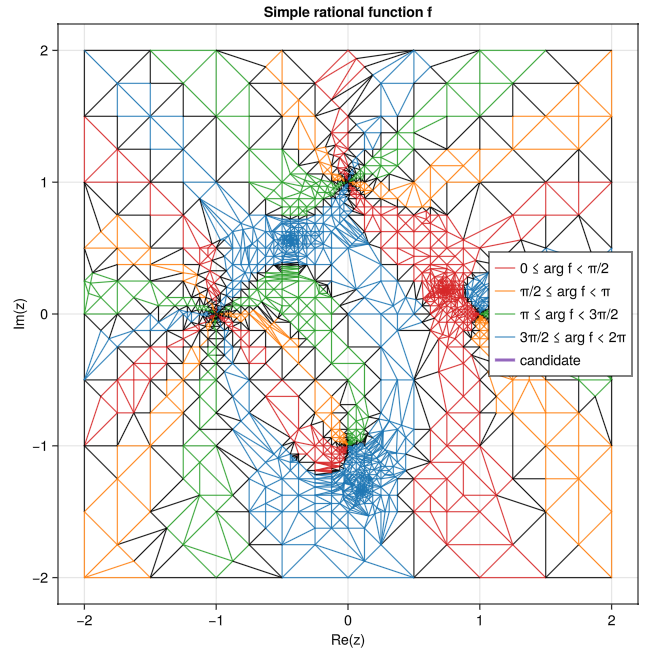

# RootsAndPoles.jl: Global complex Roots and Poles Finding in Julia

[](https://ci.appveyor.com/project/fgasdia/rootsandpoles-jl) [](https://zenodo.org/badge/latestdoi/154031378)

A Julia implementation of [GRPF](https://github.com/PioKow/GRPF) by Piotr Kowalczyk and [SA-GRPF](https://github.com/PioKow/SAGRPF) by Sebastian Dziedziewicz, Malgorzata Warecka, Rafal Lech, and Piotr Kowalczyk.

## Description

`RootsAndPoles.jl` attempts to **find all the zeros and poles of a complex valued function with complex arguments in a fixed region**.
These types of problems are frequently encountered in electromagnetics, but the algorithm can also be used for similar problems in e.g. optics, acoustics, etc.

The SA-GRPF algorithm first generates a self-adaptive mesh on the complex plane through Delaunay triangulation.
Candidate regions to search for roots and poles are determined and the discretized [Cauchy's argument principle](https://en.wikipedia.org/wiki/Argument_principle) is applied without needing the derivative of the function or integration over the contour.
To improve the accuracy of the results, mesh refinement occurs inside the identified candidate regions.



## Usage

### Installation

```julia
]add RootsAndPoles
```

### Example Problem

Consider a simple rational (complex) argument function `simplefcn(z)` for which we seek roots and poles.
```julia
function simplefcn(z)
    w = (z - 1)*(z - im)^2*(z + 1)^3/(z + im)
end
```

Next, we define parameters for the initial complex domain over which we would like to search.
Although any starting mesh can be provided, SA-GRPF will automatically refine the mesh from just 4 corner points.
`coords` below is a `ComplexMesh` object containing a vector of complex numbers representing each point of the Delaunay triangulation. The vector is modified in place.

```julia
using Random, RootsAndPoles

RNG = Random.default_rng()
coords = ComplexMesh([-2-2im, 2-2im, -2+2im, 2+2im]; rng=RNG)
```

Roots and poles can be obtained with the `rootsandpoles` function.
We only need to pass the handle to our `simplefcn` and the `origcoords`.
```julia
zroots, zpoles = rootsandpoles(simplefcn, coords)
```

### Additional parameters

Additional parameters can be provided to the triangulation and SA-GRPF algorithms by explicitly passing a `FinderParams` struct.

The `tol` parameter determines the tolerance (maximum edge length amongst edges to split) at which the mesh refinement stops.
`maxadaptivenodes` specifies the maximum number of nodes in the Delaunay triangulation before the algorithm switches from the adaptive refinement mode to the regular GRPF mode.
If the tolerance is not met, mesh refinement will stop when either `maxiters` iterations or `maxnodes` is reached. 

In practice, the root and pole accuracy is a larger value than `tol`, so `tol` needs to be set smaller than the desired tolerance on the roots and poles.
By default, the vectors of identified roots and poles are "deduplicated" in case two values within ≈ `tol` are returned for the same root or pole.
The deduplication checks for uniqueness up to one less digit after the decimal (rounded) than the order of `tol`.
For example, if `tol = 1e-9`, all entries of `zroots` and `zpoles` must be unique to the 8th digit after the decimal place.


```julia
params = FinderParams(tol=1e-6, maxadaptivenodes=500)
zroots, zpoles = rootsandpoles(simplefcn, coords; params)
```

Evaluation of the user-provided function, e.g. `simplefcn`, can be parallelized by spawning `numtasks` tasks.
The function is called at every node of the triangulation and the results should be independent of one another.
For fast-running functions like `simplefcn`, the overall runtime of `rootsandpoles` is dominated by the Delaunay triangulation itself, but for more complicated functions multithreading can provide a significant advantage.
To enable multithreading of the function calls, specify so as a `FinderParams` argument
```julia
zroots, zpoles = rootsandpoles(simplefcn, coords, FinderParams(numtasks=4))
```
By default, `numtasks = 1`.

### Saving refinement iterations

To save the output of each mesh refinement iteration, pass a `MeshIterations` object to `rootsandpoles`.

```julia
coords = ComplexMesh([-2-2im, 2-2im, -2+2im, 2+2im]; rng=RNG)
iterations = MeshIterations(coords)
zroots, zpoles = rootsandpoles(simplefcn, coords; iterations)
```

## Plotting

Although plotting is not built into this package, plots of the mesh iterations or final mesh are readily made from the `ComplexMesh` object.
Example functions for plotting using [Makie.jl](https://docs.makie.org/stable/) are provided in the `plotting.jl` file in the base of this GitHub repo.

```julia
using GLMakie

coords = ComplexMesh([-2-2im, 2-2im, -2+2im, 2+2im]; rng=RNG)
zroots, zpoles = rootsandpoles(simplefcn, coords)
fig, ax = plotquadrants(coords; title="Simple rational function f")
save("simplefcn_sagrpf.png", fig)
```

### Additional examples

See [test/](test/) for additional examples.

## Limitations

This package uses [DelaunayTriangulation.jl](https://github.com/JuliaGeometry/DelaunayTriangulation.jl) to perform the Delaunay tessellation.
`DelaunayTriangulation` is numerically limited to `Float64` precision.

## Citing

Please consider citing Piotr's publications if this code is used in scientific work:

  1. P. Kowalczyk, “Complex Root Finding Algorithm Based on Delaunay Triangulation”, ACM Transactions on Mathematical Software, vol. 41, no. 3, art. 19, pp. 1-13, June 2015. https://dl.acm.org/citation.cfm?id=2699457

  2. P. Kowalczyk, "Global Complex Roots and Poles Finding Algorithm Based on Phase Analysis for Propagation and Radiation Problems," IEEE Transactions on Antennas and Propagation, vol. 66, no. 12, pp. 7198-7205, Dec. 2018. https://ieeexplore.ieee.org/document/8457320

  3. S. Dziedziewicz, M. Warecka, R. Lech, and P. Kowalczyk, “Self-Adaptive Mesh Generator for Global Complex Roots and Poles Finding Algorithm,” IEEE Trans. Microwave Theory Techn., vol. 71, no. 7, pp. 2854–2863, Jul. 2023, doi: [10.1109/TMTT.2023.3238014](https://doi.org/10.1109/TMTT.2023.3238014).

We also encourage you to cite this package if used in scientific work.
Refer to the Zenodo DOI at the top of the page or [CITATION.bib](CITATION.bib).
